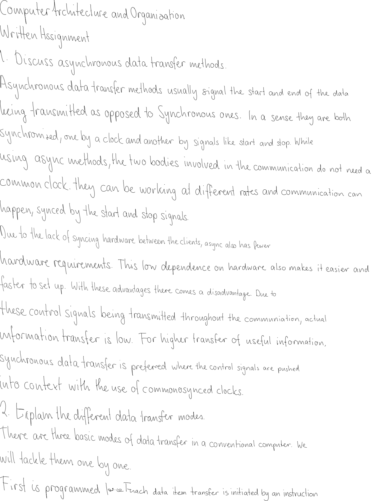

HomeWork
========

Homework could have been so much easier if only it could be submitted as a typed copy.  
Using Alex Graves' paper on handwriting generation is a step I liked. 
This script uses his amazing paper (actually the free service he has set up online) to
generate handwritten homework for given text.

Usage
-----

1. Create a plaintext file with no more than 100 chars on each line.(we call it sample.txt)
2. Navigate to the folder with the script.
3. `mkdir images pages`
4. `python get_hand.py sample.py`
5. `python make_page.py`

Example
-------

More Info
---------

[The paper](http://arxiv.org/abs/1308.0850)  
[The man behind it all. Alex Graves](http://www.cs.toronto.edu/~graves/)  
[What I am using](http://www.cs.toronto.edu/~graves/handwriting.html)
